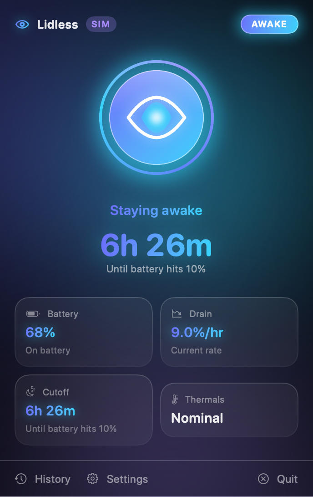
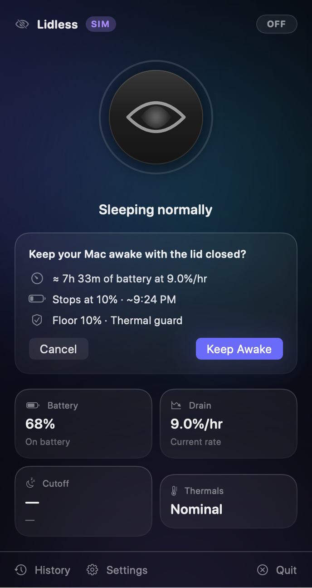
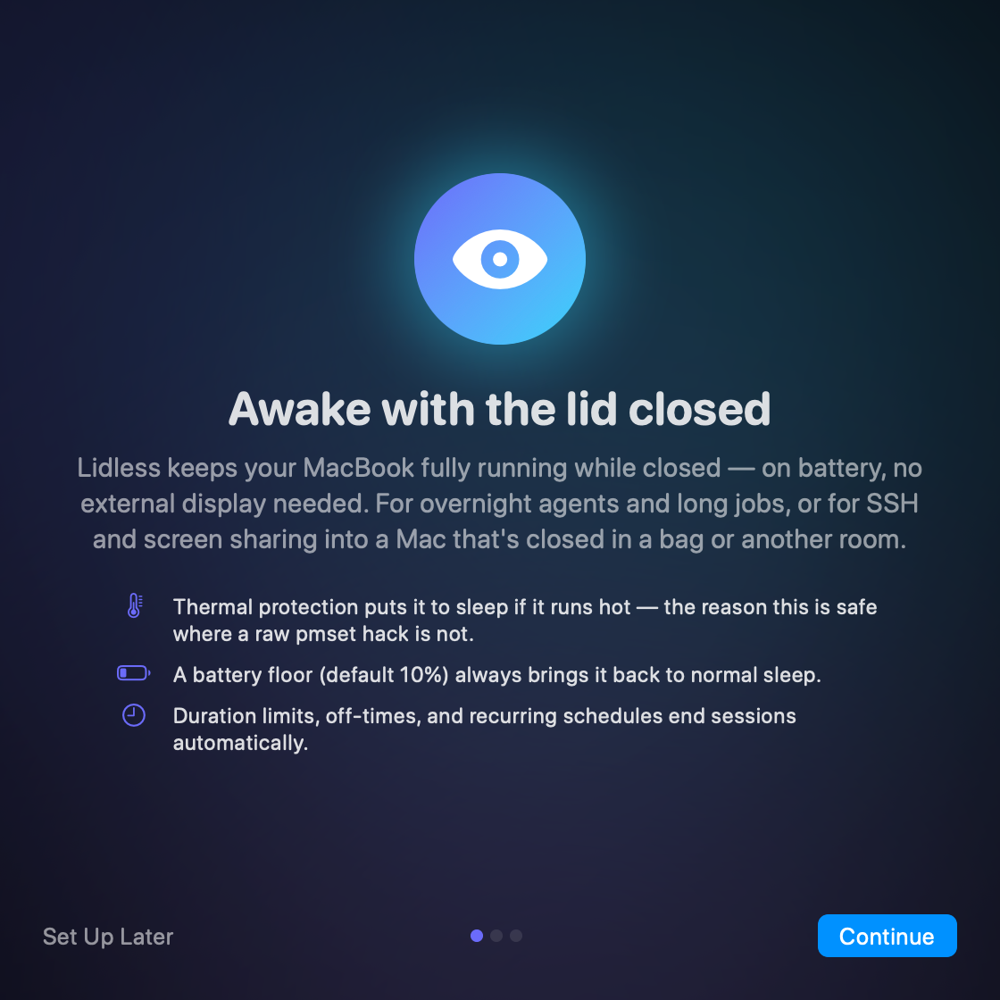

<p align="center">
  
</p>

<h1 align="center">Lidless</h1>
<p align="center"><b>Awake with the lid closed.</b><br>
A native macOS menu bar app that keeps your MacBook fully running while closed — on battery, no external display — and <i>always</i> brings it back to normal sleep.</p>

<p align="center">
  
</p>

---

macOS force-sleeps a MacBook the moment the lid closes on battery. `caffeinate` can't stop that — it only blocks *idle* sleep. The only real lever is the system-wide override `pmset disablesleep`, which is root-only, system-wide, and dangerous to leave behind. **Lidless exists to wield that lever safely**: a beautiful arming flow on top, and a paranoid, multiply-redundant safety net underneath.

Built for two kinds of people:

- **Devs running agents & long jobs overnight** on a closed MacBook — you get battery floors, thermal cutoffs, session history with drain curves, and the guarantee the override is never stranded.
- **Remote-access users** who SSH / screen-share into a MacBook closed in a bag or another room — you get "keep network alive" (tcpkeepalive enforcement) and thermal protection as a headline feature, because a closed laptop in a backpack is the worst-case thermal environment. This is what makes Lidless safe where a raw `sudo pmset -a disablesleep 1` hack is not.

## Features

- **One deliberate control.** A power-style arming button in the menu bar panel. Arming on battery always shows the projected runtime at your current drain rate; below 30% you get an explicit warning; at/under the floor it refuses.
- **Cutoffs** (each optional, sensible defaults): battery floor (default 10%, suspended while charging), thermal protection (`pmset -g therm` warning level / CPU throttling, debounced), duration limit, wall-clock off-time.
- **Quick-arm presets**: *Until 7 AM* · *4 hours* · *Until 20%*.
- **Schedules**: recurring windows (weeknights 11 PM–7 AM), automatic arm/disarm, RTC wake registered before each window so a sleeping Mac can wake itself and arm (best effort).
- **Low Power Mode & network keep-alive** while armed, both restored to their prior values on disarm.
- **On cutoff**: normal sleep restored → notification + sound → `pmset sleepnow` (only when the lid is actually closed).
- **Session history** with a battery-drain sparkline per session and full curves in detail view.
- **Widget** mirroring armed state, battery projection, and a one-click Disarm link.
- **State clarity is a feature.** The menu bar eye is filled while awake, slashed when normal, and shows a warning badge if the override is active *outside* Lidless (with a one-click Fix). Notifications on every arm/disarm/cutoff. The main window leads with "Sleeping normally" vs "Staying awake until…".
- **Dry-run mode**: `Lidless --simulate` runs the entire app — arming flow, cutoff engine, notifications — against simulated battery/thermal inputs, with a Simulator pane. No root, no system changes.
- **A living interface.** Locked to dark mode by design: a drifting aurora carries the app's mood, and the arming control is a literal eye — drowsy and blinking while dormant, wide open, glowing, and *unblinking* while on watch. Every state change springs; Reduce Motion is fully respected.

<p align="center">
  
  
</p>

## How it works

Overriding lid-close sleep requires root, so Lidless splits in two:

- **The app** (what you see): monitors battery via IOKit power-source events, polls thermals, runs the pure decision engine, and holds zero privileges.
- **The helper** (`LidlessHelper`, ~700 lines you can audit): a launchd daemon installed once via `SMAppService` — you authenticate a single time. It does exactly four things as root: `pmset disablesleep`, `pmset sleepnow`, Low Power Mode, and `tcpkeepalive`. It makes **no** decisions; it actuates, verifies by reading the power-management registry back, and enforces one invariant:

> **The sleep override must never outlive supervision.**

Every failure path restores normal sleep:

| Failure | What restores normal sleep |
|---|---|
| Cutoff fires / you disarm / you quit | Explicit restore before anything else (quit while armed asks first) |
| App crashes or hangs | Helper sees the XPC connection die → restores immediately; a 45 s heartbeat watchdog backs that up |
| Helper crashes while armed | launchd relaunches it instantly (`KeepAlive.PathState` on the sentinel file); first act on launch: restore |
| Power loss / reboot | Sentinel survives on disk; helper runs at boot (`RunAtLoad`) → restore |
| Someone force-sleeps the Mac while armed | Helper detects the sleep transition → releases the override on the way down |
| `pmset` itself fails | Sentinel stays on disk; helper retries every 30 s forever (launchd keeps it alive until it succeeds) |

The keystone is a **sentinel file** (`/var/db/lidless/override-active`) written *before* the override is enabled and deleted only *after* a verified restore. It contains everything needed to undo the session — including your *prior* values of `disablesleep`, power mode, and `tcpkeepalive`, so restore is non-destructive even if you had unusual settings.

### Verify it's off

Trust, but verify — Setup & Help shows this too:

```bash
ioreg -r -d1 -c IOPMrootDomain | grep SleepDisabled   # must say: "SleepDisabled" = No
```

### Manual fallback

If Lidless is ever gone but sleep stays disabled (no known path leads here), one command undoes the override:

```bash
sudo pmset -a disablesleep 0
```

## Install

**Build from source** (no Apple Developer account needed):

```bash
git clone https://github.com/junaidxabd/lidless && cd lidless
make build        # or: open Lidless.xcodeproj and hit Run
make run
```

Requires Xcode 16+ / macOS 15+. First launch walks you through the one-time helper authorization (System Settings → Login Items & Extensions). If you move the app after installing the helper, reinstall it from Setup & Help.

Useful targets: `make test` (151 unit tests), `make simulate` (dry-run mode), `make screenshots` (re-render README images from the live UI).

## Uninstall

Leaving is easy, and built in: **Setup & Help → Uninstall Lidless…** restores all pmset state, removes the privileged helper and its data (`/var/db/lidless`), deregisters the daemon, removes the login item, and deletes settings & history. Then drag the app to the Trash. (The manual fallback above always works too.)

## Signing & notarization

The default project signs ad-hoc ("run locally") so anyone can build without an account. Two consequences in dev builds: macOS re-asks for helper approval after each rebuild, and the sandboxed **widget** shows a placeholder (its app-group entitlement needs a signing team).

For real distribution:

1. Set your team on all three targets (or `DEVELOPMENT_TEAM` in `project.yml`), switch `CODE_SIGN_STYLE` to `Automatic`, and uncomment the two `CODE_SIGN_ENTITLEMENTS` lines in `project.yml`; run `make gen`.
2. `Scripts/release.sh` archives, exports, zips, and prints the `notarytool` submission commands. The output zip is Homebrew-cask-friendly; a sample cask lives in `Casks/lidless.rb`.

## Architecture

The interesting parts — app ↔ helper split, XPC hardening (peer code-signing requirements), the exact arming flow, failure-recovery design, and what's tested — are documented in [ARCHITECTURE.md](ARCHITECTURE.md).

## License

[MIT](LICENSE). Contributions welcome — see [CONTRIBUTING.md](CONTRIBUTING.md).
