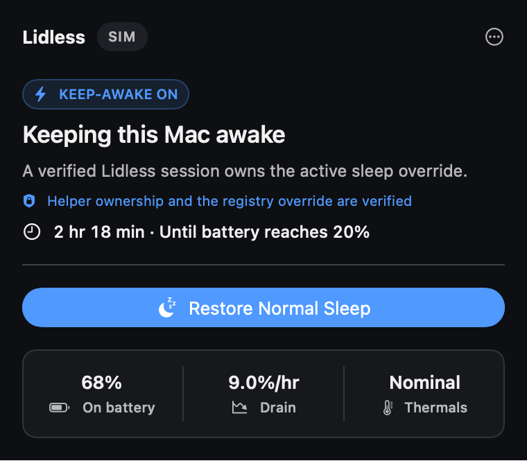
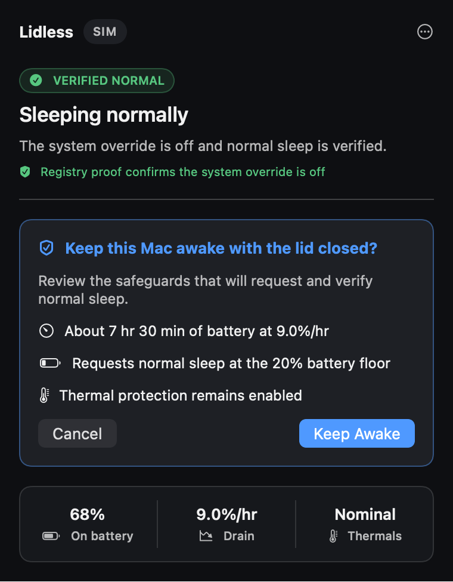
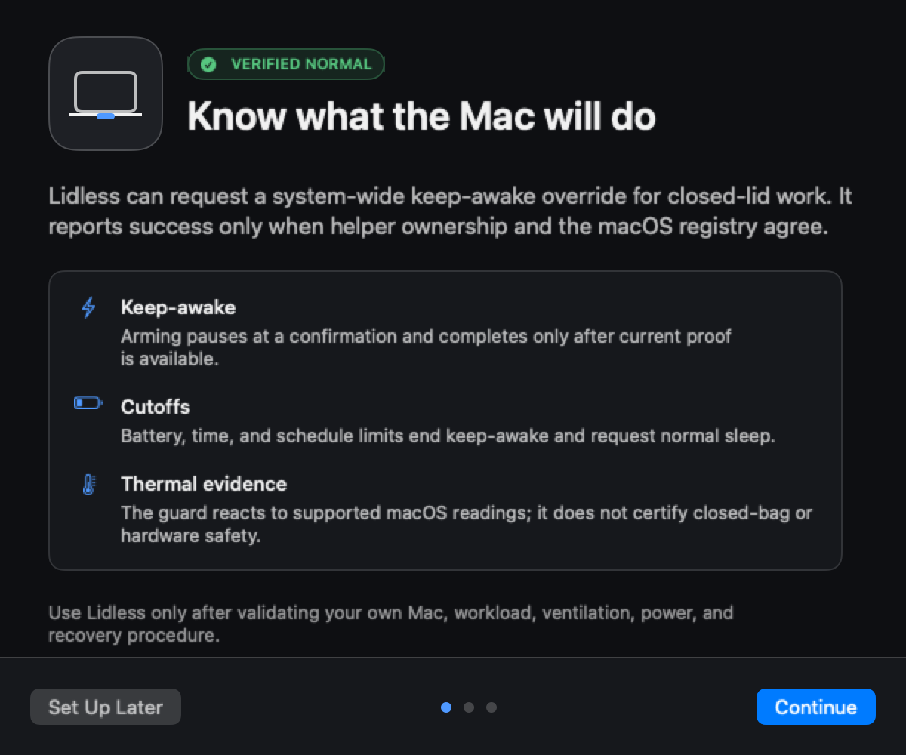

<p align="center">
  
</p>

<h1 align="center">Lidless</h1>
<p align="center"><b>Awake with the lid closed.</b><br>
A native macOS dark safety instrument for requesting and verifying a supervised lid-close sleep override.</p>

<p align="center">
  
</p>

Visual screenshots are interface evidence only; they do not prove helper installation, signed runtime behavior, hardware cutoffs, or restoration on a real Mac.

---

macOS force-sleeps a MacBook the moment the lid closes on battery. `caffeinate` can't stop that — it only blocks *idle* sleep. The only real lever is the system-wide override `pmset disablesleep`, which is root-only, system-wide, and dangerous to leave behind. Lidless is an engineering effort to mediate that lever with layered safeguards; the remaining live and hardware gates in this document are part of its safety boundary.

Built for two kinds of people:

- **Devs running agents & long jobs overnight** on a closed MacBook — you get battery floors, thermal cutoffs, session history with drain curves, and redundant supervision of the override.
- **Remote-access users** who SSH / screen-share into a MacBook closed in a bag or another room — you get "keep network alive" (tcpkeepalive enforcement) and thermal protection as a headline feature, because a closed laptop in a backpack is the worst-case thermal environment. These controls are intended to reduce risks that a raw `sudo pmset -a disablesleep 1` command does not address; they are not a substitute for the uncompleted live and hardware validation.

## Features

- **One deliberate control.** A power-style arming button in the menu bar panel. A floor-protected arm requires readable battery evidence, and a thermal-protected arm requires a fresh, structurally meaningful `pmset` sample without an active threshold violation or serious system pressure. Unavailable or already-hot thermal evidence refuses the arm; below 30% battery you get an explicit warning, and at/under the floor it refuses.
- **Cutoffs** (each optional, sensible defaults): battery floor (default 10%, suspended while charging; telemetry loss starts verified restoration), thermal protection (`pmset -g therm` warning level / CPU throttling plus `ProcessInfo` pressure, source-aware debounce; missing, structurally invalid, future-dated, or more than 180-second-old `pmset` evidence starts verified restoration), duration limit, wall-clock off-time. Recognized malformed or contradictory `pmset` fields invalidate the whole sample. Restoration remains pending until normal sleep is proven.
- **Quick-arm presets**: *Until 7 AM* · *4 hours* · *Until 20%* (the battery-only preset is unavailable on a machine proven to have no internal battery).
- **Schedules**: recurring windows (weeknights 11 PM–7 AM), automatic arm/disarm, and an RTC-wake transaction with a fail-closed parser, durable intent, exact readback, duplicate cancellation, and crash/restart reconciliation. Real `pmset` scheduling remains an OS/runtime gate.
- **Low Power Mode & network keep-alive** while armed, both restored to their prior values on disarm.
- **Cutoff sequence**: prove normal-sleep restoration, then notify and request `sleepnow` only with the lid closed. Generation-bound local policy prevents stale or duplicate follow-ups; real sleep-transition behavior remains a hardware gate.
- **Session history** with a battery-drain sparkline per session and full curves in detail view.
- **Widget surface** designed to mirror armed state and battery projection with a Disarm link; signed app-group behavior remains a live gate.
- **Proof-first states.** The menu bar, main window, onboarding, and widget distinguish verified normal, verified armed, restoring, outside override, stale helper, and unverified state. Unknown evidence never borrows a reassuring status.
- **Dry-run mode**: `Lidless --simulate` runs the entire app — arming flow, cutoff engine, notifications — against simulated battery/thermal inputs, with a Simulator pane. No root, no system changes.
- **A quiet native control center.** The dark-only interface uses native type, system symbols, semantic state color, and explicit proof text. Motion is restrained and Reduce Motion is respected.

<p align="center">
  
  
</p>

## How it works

Overriding lid-close sleep requires root, so Lidless splits in two:

- **The app** (what you see): monitors battery via IOKit power-source events, polls thermals, runs the pure decision engine, and holds zero privileges.
- **The helper** (`LidlessHelper`): a launchd daemon managed through `SMAppService`. Its narrow root surface manages `disablesleep`, optional `sleepnow`, Low Power Mode, `tcpkeepalive`, scheduled wakes, and recovery. It makes **no** cutoff decisions; it actuates, reads system state back, and is designed around one invariant:

> **The sleep override must never outlive supervision.**

The local release candidate keeps recovery pending until exact evidence proves
normal sleep and any helper-owned obligations are reconciled. These mechanisms
are covered by deterministic and source-contract tests; they are not claims of
signed-runtime, crash, reboot, sleep/wake, or hardware validation:

| Trigger | Mechanism and current evidence boundary |
|---|---|
| Cutoff, disarm, or quit | Generation-bound app coordination keeps the session pending until helper and independent registry evidence prove normal sleep |
| App crash or hang | Helper invalidation and watchdog paths request restoration; real XPC failure behavior remains a live gate |
| Helper crash while armed | Sentinel and mutation markers configure `KeepAlive.PathState`; actual launchd relaunch behavior remains a live gate |
| Power loss or reboot | Durable witnesses and `RunAtLoad` provide a recovery path; reboot recovery remains a hardware gate |
| Sleep transition while armed | The helper's sleep observer requests restoration; sleep/wake behavior remains a hardware gate |
| `pmset` timeout/failure | Bounded children, durable mutation uncertainty, and retry state prevent an unobserved outcome from being called safe; real compounded-failure behavior is not established offline |

The keystone is a **sentinel file** (`/var/db/lidless/override-active`) written *before* the override is enabled. After Lidless mutates the system it is deleted only after a verified restore; an unused prepared marker may be removed after a proven pre-mutation rejection. It records the prior power-mode and `tcpkeepalive` values. A legacy `disablesleep` field remains decodable, but current recovery deliberately restores ordinary sleep (`disablesleep 0`) rather than preserving an outside override.

### Verify it's off

Trust, but verify — Setup & Help shows this too:

```bash
ioreg -r -d1 -c IOPMrootDomain | grep SleepDisabled   # must say: "SleepDisabled" = No
```

### Manual fallback

If the observed system state does not match the app, one command restores ordinary sleep:

```bash
sudo pmset -a disablesleep 0
```

## Install

**Core tests or unsigned compile verification** (no Apple Developer account needed):

```bash
git clone https://github.com/junaidxabd/lidless && cd lidless
make test
xcodebuild -project Lidless.xcodeproj -scheme Lidless \
  -configuration Debug -derivedDataPath build/DerivedData \
  CODE_SIGNING_ALLOWED=NO build
```

Unsigned output is compile evidence only: do not run it with the privileged helper. Runtime candidates require one real Apple signing team with the app, widget, helper identifiers, and app-group capability configured. Helper approval, signed XPC trust, and app-group behavior still require separate live validation.

Useful targets: `make test` (the deterministic core suite), `make simulate` (signed dry-run mode), `make screenshots` (the built app's simulation renderer), and `make visual-evidence` (the complete repository-local app/widget/icon matrix and all contact sheets, with no helper installation or system mutation).

## Uninstall

Public cleanup, replacement, and uninstall controls are intentionally disabled. Their app entry points and compatibility XPC selectors are mutation-free refusals, because removing launchd supervision without a signed, revision-specific procedure would weaken recovery. Before any future removal, verify registry state independently; if state is uncertain, use the manual fallback above. A signed, tested removal workflow remains separate work.

## Signing & notarization

Release policy requires one signing team across the app, widget, and privileged helper. The helper's client requirement is designed to reject ad-hoc or identifier-only impostors, and app-group entitlements are configured for the app and widget. Actual signed XPC acceptance and widget sharing remain live validation gates.

Account-free CI is configured to compile the graph with `CODE_SIGNING_ALLOWED=NO`, but that unsigned artifact is not runnable against the privileged helper. Forks using another Apple team must provision or rename the identifiers and app group consistently, update `project.yml` and the release policy, then run `make gen`.

For distribution:

1. Confirm the configured team has the three identifiers and `group.com.lidless.shared` capability available.
2. `Scripts/release.sh prepare` archives and Developer-ID exports, then requires the repository verifier and macOS notarization-submission policy check before creating a submission zip. A positive signed export has not been established by the offline safety repair.
3. Under a separate credentialed release gate, notarize and staple the app, then run `Scripts/release.sh finalize`. Finalization requires the stapled-ticket, execution-policy, repository, and macOS distribution checks before creating the Homebrew-cask-friendly zip and printing its SHA-256.

## Architecture

The interesting parts — app ↔ helper split, XPC hardening (peer code-signing requirements), the exact arming flow, failure-recovery design, and what's tested — are documented in [ARCHITECTURE.md](ARCHITECTURE.md).

The current local-candidate verdict, exact evidence, hashes, blocked checks, and
remaining live gates are recorded in
[Docs/verification/local-rc-2026-08-07.md](Docs/verification/local-rc-2026-08-07.md).
The durable successor entry point is
[Docs/orchestration/LIDLESS-LOCAL-RC-HANDOFF-2026-08-07.md](Docs/orchestration/LIDLESS-LOCAL-RC-HANDOFF-2026-08-07.md).

## License

[MIT](LICENSE). Contributions welcome — see [CONTRIBUTING.md](CONTRIBUTING.md).
